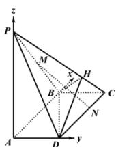

> [!faq]- 全练一本通解析
> **【答案】** G 为 PD 上靠近 D 的三等分点，理由见解析
>
> **【解析】**
> ∵ PA⊥平面 ABCD，四边形 ABCD 为矩形，∴ PA, AB, AD 两两互相垂直，则以 A 为坐标原点， $\overrightarrow{AB},\overrightarrow{AD},\overrightarrow{AP}$ 正方向为 x,y,z 轴可建立空间直角坐标系，
> 
> $\therefore A(0,0,0), B(2,0,0), D(0,1,0), P(0,0,2), C(2,1,0), M(1,0,1), H\left(\frac{3}{2}, \frac{3}{4}, \frac{1}{2}\right)$ ,
> （1）设 $G(x,y,z)$ ，且 $\overrightarrow{PG} = \lambda \overrightarrow{PD} (0 \leq \lambda \leq 1)$ ，
> 又 $\overrightarrow{PG} = (x,y,z - 2)$ ， $\overrightarrow{PD} = (0,1, - 2)$ ，∴ $\left\{ \begin{array}{ll}x = 0\\ y = \lambda \\ z - 2 = -2\lambda \end{array} \right.$ ，∴ $G(0,\lambda ,2 - 2\lambda)$
> $$
> \therefore \overrightarrow {A G} = (0, \lambda , 2 - 2 \lambda);
> $$
> 设平面 BDH 的法向量 $\overrightarrow{n_{1}}=(x_{1},y_{1},z_{1})$ ，又
> $$
> \overrightarrow {B D} = (- 2, 1, 0), \overrightarrow {D H} = \left(\frac {3}{2}, - \frac {1}{4}, \frac {1}{2}\right)
> $$
> $\therefore \left\{ \begin{array}{l} \overline{n_1} \cdot \overline{BD} = -2x_1 + y_1 = 0 \\ \overline{n_1} \cdot \overline{DH} = \frac{3}{2} x_1 - \frac{1}{4} y_1 + \frac{1}{2} z_1 = 0 \end{array} \right.$ 令 $x_1 = 1$ ，则
> $$
> y _ {1} = 2, z _ {1} = - 2, \therefore \overrightarrow {n _ {1}} = (1, 2, - 2)
> $$
> ∵ AG// 平面 BDH，∴ $\overrightarrow{AG} \perp \overrightarrow{n_{1}}$ ，即 $\overrightarrow{AG} \cdot \overrightarrow{n_{1}} = 2\lambda - 2(2 - 2\lambda) = 0$ ，解
> 得： $\lambda = \frac{2}{3}$
> $\therefore \overrightarrow{PG} = \frac{2}{3}\overrightarrow{PD}$ ，即 $G$ 为 $PD$ 上靠近 $D$ 的三等分点，此时 $AG / /$ 平面 $BDH$
