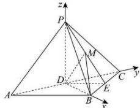

> [!faq]- 全练一本通解析
> **【答案】** M 为 PE 上靠近 E 的三等分点
>
> **【解析】**
> 由题意,
> 在三棱锥 $P - ABC$ 中， $DB \perp DC$
> $PD \perp$ 平面 ABC, $DB \subset$ 平面 ABC, $DC \subset$ 平面 ABC
> $\therefore PD \perp DB, PD \perp DC,$
> 建立空间直角坐标系如下图所示，
> 
> $\therefore B(\sqrt{2},0,0)$ , $D(0,0,0)$ , $C(0,\sqrt{2},0)$ , $E\left(\frac{\sqrt{2}}{2},\frac{\sqrt{2}}{2},0\right)$ , $A(0,-\sqrt{2},0)$ ,
> $$
> P (0, 0, \sqrt {2})
> $$
> 设 $\overrightarrow{PM} = \lambda \overrightarrow{PE} (0 < \lambda < 1)$ .
> $$
> \cdot \overrightarrow {D B} = (\sqrt {2}, 0, 0), \overrightarrow {P B} = (\sqrt {2}, 0, - \sqrt {2}), \overrightarrow {P C} = (0, \sqrt {2}, - \sqrt {2})
> $$
> $$
> \overrightarrow {P E} = \left(\frac {\sqrt {2}}{2}, \frac {\sqrt {2}}{2}, - \sqrt {2}\right), \overrightarrow {D P} = (0, 0, \sqrt {2}).
> $$
> $\therefore \overrightarrow{DM} = \overrightarrow{DP} +\overrightarrow{PM} = \overrightarrow{DP} +\lambda \overrightarrow{PE} = \left(\frac{\sqrt{2}}{2}\lambda ,\frac{\sqrt{2}}{2}\lambda ,(1 - \lambda)\sqrt{2}\right),$
> 设平面 MBD 法向量为 $\overrightarrow{n_{1}}=\left(x_{1},y_{1},z_{1}\right)$
> 则 $\left\{ \begin{array}{l} \overrightarrow{DB} \cdot \overrightarrow{n_1} = \sqrt{2} x_1 = 0 \\ \overline{DM} \cdot \overline{n_1} = \frac{\sqrt{2}}{2} \lambda x_1 + \frac{\sqrt{2}}{2} \lambda y_1 + (1 - \lambda) \sqrt{2} z_1 = 0 \end{array} \right.$ ，令 $z_1 = \lambda$ ，可得 $\overline{n_1} = (0, 2(\lambda - 1), \lambda)$ ，
> 设平面 $PBC$ 法向量为 $\overrightarrow{n_2} = (x_2, y_2, z_2)$
> 则 $\left\{ \begin{array}{l} \overrightarrow{PB} \cdot \overrightarrow{n_2} = \sqrt{2} x_2 - \sqrt{2} z_2 = 0 \\ \overrightarrow{PC} \cdot \overrightarrow{n_2} = \sqrt{2} y_2 - \sqrt{2} z_2 = 0 \end{array} \right.$ ，可令 $x_2 = y_2 = 1$ ，可得 $\overrightarrow{n_2} = (1,1,1)$ ，
> 要使平面 $MBD \perp$ 平面 PBC，则 $\overrightarrow{n_{1}} \cdot \overrightarrow{n_{2}} = 0$ ，
> ∴ $\overrightarrow{n_{1}}\cdot\overrightarrow{n_{2}}=0+2(\lambda-1)+\lambda=0$ , 解得 $\lambda=\frac{2}{3}$
> ∴ 即 $\overrightarrow{PM} = \frac{2}{3} \overrightarrow{PE}$ 时平面 $MBD \perp$ 平面 PBC，
> ∴ M 为 PE 上靠近 E 的三等分点时平面 $MBD \perp$ 平面 PBC
