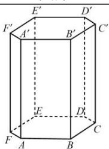
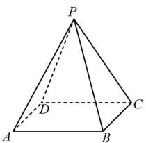
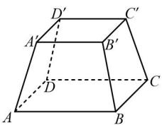
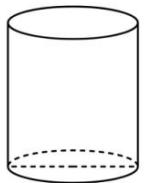
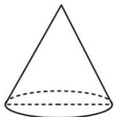
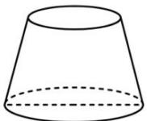
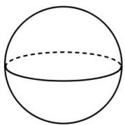

## 2. 柱、锥、台、球的结构特征

<table><tr><td>几何体</td><td>定义</td><td>分类及表示</td><td>图形</td></tr><tr><td>棱柱</td><td>有两个面互相平行,其余各面都是四边形,且每相邻两个四边形的公共边都互相平行,由这些面所围成的几何体.</td><td>分类:三棱柱,四棱柱等.特征:1两底面相互平行2侧面都是平行四边形3每相邻两个侧面的公共边相互平行</td><td></td></tr><tr><td>棱锥</td><td>有一个面是多边形,其余各面都是有一个公共顶点的三角形,由这些面所围成的几何体</td><td>分类:三棱锥,四棱锥等.特征:1底面是多边形2侧面是三角形3侧面有一个公共顶点</td><td></td></tr><tr><td>棱台</td><td>用一个平行于棱锥底面的平面去截棱锥,截面和底面之间的部分</td><td>分类:三棱台,四棱台等.特征:1上下底面是相似的平行多边形2侧面是梯形3侧棱交于原棱锥的顶点</td><td></td></tr><tr><td>圆柱</td><td>以矩形的一边所在的直线为轴旋转,其余三边旋转所成的曲面所围成的几何体</td><td>特征:1轴截面为矩形2底面是相互平行且全等的圆3母线有无数条,都平行于轴</td><td></td></tr><tr><td>圆锥</td><td>以直角三角形的一条直角边为旋转轴,旋转一周所成的曲面所围成的几何体</td><td>特征:1底面是一个圆2母线交于圆锥的顶点3侧面展开图是一个扇形</td><td></td></tr><tr><td>圆台</td><td>用一个平行于圆锥底面的平面去截圆锥,截面和底面之间的部分</td><td>特征:1上下底面是两个圆2侧面母线交于原圆锥的顶点3侧面展开图是一个弓形</td><td></td></tr><tr><td>球体</td><td>以半圆的直径所在直线为旋转轴,半圆面旋转一周形成的几何体</td><td>特征:1球的截面是圆2球面上任意一点到球心的距离等于半径</td><td></td></tr></table>
