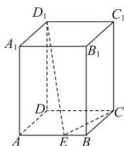

<!-- question-source:start -->
【22】（2024·上海浦东高二期中）如图，在长方体 $ABCD-A_{1}B_{1}C_{1}D_{1}$ 中， $AB=AD=1,AA_{1}=2\sqrt{2}$ ，点E为AB上的动点，则 $D_{1}E+CE$ 的最小值为（）

A. 5 B. $\sqrt{15}$ C. $2 + 2\sqrt{2}$ D. $\sqrt{17}$
<!-- question-source:end -->

![[Q00005716A1]]
