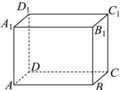

<!-- question-source:start -->
【26】（2023·湖南岳阳模拟预测）如图，在长方体 $ABCD-A_{1}B_{1}C_{1}D_{1}$ 中，AB=4,AD=2, $AA_{1}=3$ ，一小虫从顶点A出发沿长方体的表面爬到顶点 $C_{1}$ ，则小虫走过的最短路线的长为\_\_\_\_。

<!-- question-source:end -->

![[Q00005720A1]]
