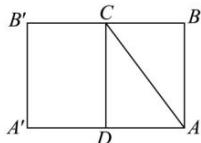

> [!faq]- 全练一本通解析
> **【答案】** 20cm
>
> **【解析】**
> 作出圆柱的侧面展开图如下图所示,
> 
> 则当昆虫的爬行路线为线段 AC 时, 爬行的路程最短,
> ∵ 圆柱体的底面周长为 24cm，∴ $AD=\frac{1}{2}\times24=12(cm)$ ;
> ∴ 最短路程为: $\sqrt{AD^{2}+CD^{2}}=\sqrt{12^{2}+16^{2}}=20\left(\mathrm{cm}\right)$ . 故答案为: 20cm.
