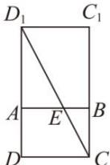

> [!faq]- 全练一本通解析
> **【答案】** D
>
> **【解析】**
> 解析: 将 ABCD 绕 AB 翻折到与 $ABC_{1}D_{1}$ 共面, 平面图形如下所示:
> 
> 连接 $CD_{1}$ ，则 $CD_{1}$ 的长度即为 $D_{1}E + CE$ 的最小值，
> 因为 $AB = AD = 1, AA_{1} = 2\sqrt{2}$ ，所以 $AD_{1} = \sqrt{1^{2} + (2\sqrt{2})^{2}} = 3$
> 所以 $DD_{1} = 4$ ，所以 $CD_{1} = \sqrt{1^{2} + 4^{2}} = \sqrt{17}$ ，即 $D_{1}E + CE$ 的最小值为 $\sqrt{17}$
>
> 故选 **D**
