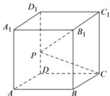
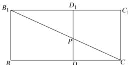

> [!faq]- 全练一本通解析
> **【答案】** $2\sqrt{4+2\sqrt{2}}$
>
> **【解析】**
> 如图将平面 $BB_{1}D_{1}D$ 绕 $D_{1}D$ 翻折到与平面 $CC_{1}D_{1}D$ 共面（如下平面图形），
> 连接 $B_{1}C$ 交 $DD_{1}$ 于点 $P$ ，此时 $PB_{1} + PC$ 取得最小值 $B_{1}C$
> 又 $DC = BB_{1} = 2$ ， $BD = \sqrt{2^2 + 2^2} = 2\sqrt{2}$ ，所以 $BC = 2 + 2\sqrt{2}$
> 则 $B_{1}C = \sqrt{2^{2} + (2 + 2\sqrt{2})^{2}} = 2\sqrt{4 + 2\sqrt{2}}$
> 即 $PB_{1} + PC$ 的最小值为 $2\sqrt{4 + 2\sqrt{2}}$
> 故答案为: $2 \sqrt{4 + 2 \sqrt{2}}$
> 
> 
