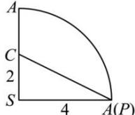

> [!faq]- 全练一本通解析
> **【答案】** A
>
> **【解析】**
> 解析:由题意,底面圆的直径 AB=2, 故底面周长等于 $2\pi$ .
> 
> 设圆锥的侧面展开后的扇形圆心角为 $n^{\circ}$ 根据底面周长等于展开后扇形的弧长得 $2\pi = \frac{4n\pi}{180}$ ，解得 $n = 90$ 所以展开图中 $\angle PSC = 90^{\circ}$ ，故 $PC = 2\sqrt{5}$ ，所以小虫爬行的最短距离为 $2\sqrt{5}$ 。
>
> 故选 **A**
