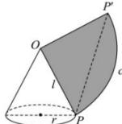

> [!faq]- 全练一本通解析
> **【答案】** $2\sqrt{2}\quad\frac{2\sqrt{2}}{3}\pi$
>
> **【解析】**
> 作出该圆锥的侧面展开图,如图所示:
> 
> 该小虫爬行的最短路程为 $PP'$ ，由余弦定理可得： $\cos \angle P'OP = \frac{OP^2 + OP'^2 - PP'^2}{2OP \cdot OP'} = \frac{3^2 + 3^2 - (3\sqrt{3})^2}{2 \times 3 \times 3} = -\frac{1}{2}$ ，所以 $\angle P'OP = \frac{2\pi}{3}$ 。设底面圆的半径为 $r$ ，则有 $2\pi r = \frac{2\pi}{3} \cdot 3$ ，解得 $r = 1$ 所以这个圆锥的高 $h = \sqrt{9 - 1} = 2\sqrt{2}$ ，体积 $V = \frac{1}{3}\pi r^2 h = \frac{2\sqrt{2}}{3}\pi$ 。故答案为： $2\sqrt{2} ; \frac{2\sqrt{2}}{3}\pi$ 。
