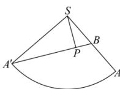

> [!faq]- 全练一本通解析
> **【答案】** D
>
> **【解析】**
> D解析：以 $SA$ 为分界线，将圆锥的侧面展开，可得其展开图如图.则从点 $A$ 到点 $B$ 的最短路径为线段 $A'B$ ， $l_{\widehat{AA}} = 2\pi$ ，所以 $\angle A'SA = \frac{l_{\widehat{AA'}}}{4} = \frac{\pi}{2}$ 过 $S$ 作 $SP \perp A'B$ ，则公路距山顶的最近距离为 $SP$ 因为 $A'B = \sqrt{4^2 + 2^2} = 2\sqrt{5}$ ，所以 $SP = \frac{SA \cdot SA'}{BA'} = \frac{8}{2\sqrt{5}} = \frac{4\sqrt{5}}{5}$ ，故选：D.
> 
