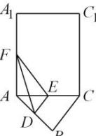
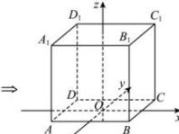

> [!faq]- 全练一本通解析
> **【答案】** $\sqrt{7} +2$
>
> **【解析】**
> 由正三棱柱 $A_{1}B_{1}C_{1}-ABC$ ，可得 $AA_{1}\perp$ 底面 ABC，
> ∴ $AA_{1}\perp AB,\quad AA_{1}\perp AC.$ 在 Rt△ADF 中， $DF=\sqrt{(\sqrt{3})^{2}+1^{2}}=2.$ 把底面 ABC 展开与侧面 $ACC_{1}A_{1}$ 在同一个平面，如图所示，
> 
> 只有当三点 $D$ ， $E$ ， $F$ 在同一条直线时， $DE + EF$ 取得最小值.在 $\triangle ADF$ 中， $\angle DAF = 60^{\circ} + 90^{\circ} = 150^{\circ}$ ，由余弦定理可得： $DF = \sqrt{(\sqrt{3})^2 + 1^2 - 2\sqrt{3}\times\cos150^\circ} = \sqrt{7}$ ： $\therefore \triangle DEF$ 周长的最小值 $= \sqrt{7} +2$ ，故答案为： $\sqrt{7} +2$ ：
> 
