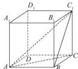

> [!faq]- 全练一本通解析
> **【答案】** CD
>
> **【解析】**
> 解析:对于 A: 底面是正多边形, 当顶点在底面的投影是正多边形的中心才是正棱锥, 其他情况不是正棱锥, A 错误;
> 对于 B: 当平面与圆柱的母线平行或者垂直时, 截得的截面才是矩形或圆, 否则为椭圆或椭圆的一部分, B 错误;
> 对于 C: 长方体的侧棱垂直于底面, 各个侧面都是平行四边形, 所以长方体是直平行六面体, C 正确;
> 对于 D: 正方体 $ABCD - A_{1}B_{1}C_{1}D_{1}$ 中的三棱锥 $C_{1} - ABC$ ，四个面都是直
> 角三角形, D 正确.
> 
>
> 故选 **CD**.
