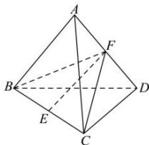

> [!faq]- 全练一本通解析
> **【答案】** A
>
> **【解析】**
> 解析: 连接 BF, CF
> 在正四面体 ABCD 中, 因为 F 为 AD 的中点,
> 所以 $BF \perp AD, CF \perp AD$
> 因此 $BF = CF = \sqrt{1 - \left(\frac{1}{2} \times 1\right)^2} = \frac{\sqrt{3}}{2}$ ，而 $E$ 为 $BC$ 中点，
> 所以 $EF \perp BC$ ，
> 因此 $EF = \sqrt{BF^{2} - BE^{2}} = \sqrt{\left(\frac{\sqrt{3}}{2}\right)^{2} - \left(\frac{1}{2} \times 1\right)^{2}} = \frac{\sqrt{2}}{2}$ ,
> 故选:A
> 
