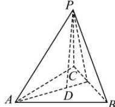

> [!faq]- 全练一本通解析
> **【答案】** $\sqrt{6}$
>
> **【解析】**
> 如图,三棱锥 P-ABC 棱长都是 3,
> 
> 设顶点 P 在底面上的射影为 D，则 D 是等边 ABC 的中心，
> AD 为 $\triangle ABC$ 外接圆半径， $AD=\frac{AB}{2\sin60^{\circ}}=\frac{3}{2\times\frac{\sqrt{3}}{2}}=\sqrt{3}$
> 则在直角三角形 PAD 中， $PA = 3, AD = \sqrt{3}$
> 所以三棱锥的高 $PD = \sqrt{PA^2 - AD^2} = \sqrt{9 - 3} = \sqrt{6}$
> 故答案为: $\sqrt{6}$
