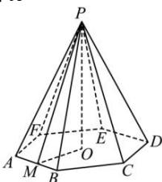

> [!faq]- 全练一本通解析
> **【答案】** A
>
> **【解析】**
> 解析：
> 
> 如图正六棱锥 P-ABCDEF 中，底面中心为 O，取 AB 的中点 M，连接 PM，OM，
> 则 $AB \perp PM, AB \perp OM$ ，所以 $\angle PMO$ 为侧面和底面的夹角，即
> $$
> \angle P M O = 6 0 ^ {\circ}
> $$
> 因为 $PO \perp$ 底面 $ABCDEF$ ， $OM \subset$ 底面 $ABCDEF$ ，
> 所以 $PO \perp OM$ ，所以 $\frac{PO}{OM} = \tan 60^{\circ} = \sqrt{3}$
> 又 $OM = \frac{\sqrt{3}}{2} AB$ ，所以 $\frac{PO}{\frac{\sqrt{3}}{2} AB} = \sqrt{3}$
> 所以 $\frac{PO}{AB} = \sqrt{3}\times \frac{\sqrt{3}}{2} = \frac{3}{2}$ .
>
> 故选 **A**
