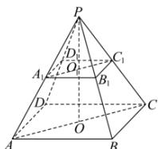

> [!faq]- 全练一本通解析
> **【答案】** D
>
> **【解析】**
> 解析: 正四棱台 $ABCD-A_{1}B_{1}C_{1}D_{1}$ 的侧棱延长线交于点 P，则 P-ABCD 是正四棱锥，
> $O,O_{1}$ 分别是正方形 ABCD, $A_{1}B_{1}C_{1}D_{1}$ 的中心, 则 $P,O_{1},O$ 共线, 且 PO 是正四棱锥 P-ABCD 的高,
> 连接 $AC, A_{1}C_{1}$ ，则有 $AC // A_{1}C_{1}, PO \perp AC$ ，于是 $\triangle PA_{1}C_{1} \sim \triangle PAC$ ，
> 因此 $\frac{PO_1}{PO} = \frac{A_1C_1}{AC}$ ，即 $\frac{h}{h + OO_1} = \frac{\sqrt{2}a}{\sqrt{2}b}$ ，解得 $OO_{1} = \frac{(b - a)h}{a}$
> 所以该四棱台的高为 $\frac{(b-a)h}{a}$ .
> 
>
> 故选 **D**
