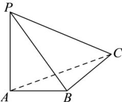

<!-- question-source:start -->
【9】（2024·上海虹口高二期中）如图, 已知三棱锥 P-ABC 中, $PA \perp$ 平面 ABC, $AB \perp BC$ , PA = 4, AB = 3, AC = 5. 则点 A 到平面 PBC 的距离 \_\_\_\_.

<!-- question-source:end -->

![[Q00006023A1]]
