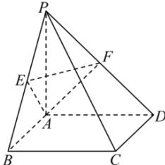

<!-- question-source:start -->
【14】（2024·陕西安康模拟预测）如图，在四棱锥P-ABCD中，底面ABCD是边长为2的正方形，且 $CB\perp BP$ ， $CD\perp DP$ ，PA=2，点E，F分别为PB，PD的中点.

（1）求证： $PA \perp$ 平面 ABCD；

(2) 求点 P 到平面 AEF 的距离.

<!-- question-source:end -->

![[Q00006028A1]]
