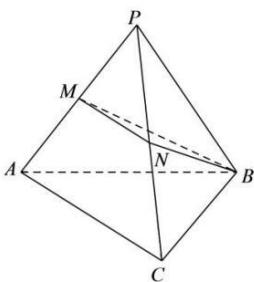

<!-- question-source:start -->
【16】（2024…浙江高二阶段练习）如图, 正四面体 P-ABC 的棱长为 4, 点 M、N 分别是棱 PA、PC 的中点, 求点 A 到平面 BMN 的距离.

转化成求另一点到该平面的距离, 常见转化为求与面平行的直线上的点到面的距离.
<!-- question-source:end -->

![[Q00006030A1]]
