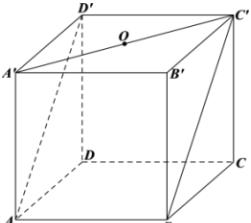

<!-- question-source:start -->
【20】（20-21 高二下·新疆哈密·期中）如图所示，正方体 $ABCD - A'B'C'D'$ 的棱长为 1，点 O 是平面 $A'B'C'D'$ 的中心，则 O 到平面 $ABC'D'$ 的距离是（）

A. $\frac{1}{2}$ B. $\frac{\sqrt{2}}{4}$ C. $\frac{\sqrt{2}}{2}$ D. $\frac{\sqrt{3}}{2}$
<!-- question-source:end -->

![[Q00006034A1]]
