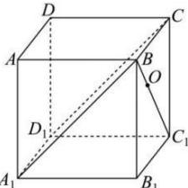

<!-- question-source:start -->
【21】(2023·全国高三模拟预测)如图所示,已知正方体 $ABCD-A_{1}B_{1}C_{1}D_{1}$ 的棱长为 1, 点 O 在线段 $BC_{1}$ 上, 且满足 $BO=\frac{1}{2}OC_{1}$ , 则点 O 到平面 $BCD_{1}A_{1}$ 的距离是（）

A. $\frac{1}{3}$ B. $\frac{\sqrt{2}}{6}$ C. $\frac{\sqrt{2}}{3}$ D. $\frac{\sqrt{3}}{2}$
<!-- question-source:end -->

![[Q00006035A1]]
