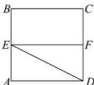
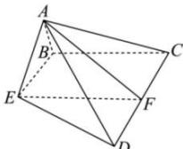

<!-- question-source:start -->
【23】（2022 全国高三·专题练习）如图, 正方形 ABCD 的边长为 2, E, F 分别是 AB, CD 的中点, 将 $\triangle ADE$ 沿 DE 折起, 使得 $\triangle ACD$ 为正三角形.

（1）求证： $CD\perp$ 平面 $AEF$

(2) 求点 C 到平面 AED 的距离.
<!-- question-source:end -->

![[Q00006037A1]]
