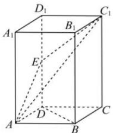

<!-- question-source:start -->
【24】（2024·陕西高三二模）如图所示，在直四棱柱 $ABCD-A_{1}B_{1}C_{1}D_{1}$ 中，底面ABCD为菱形，AB=2， $\angle BAD=60^{\circ}$ ， $AA_{1}=4\sqrt{2}$ ，E是 $DD_{1}$ 的中点.

(1) 证明: $BD \parallel$ 平面 $AC_{1}E$ ; (2) 求点 $B$ 到平面 $AC_{1}E$ 的距离.
<!-- question-source:end -->

![[Q00006038A1]]
