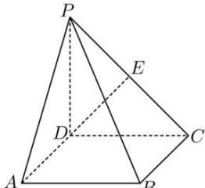

> [!faq]- 全练一本通解析
> **【答案】** $\frac{\sqrt{7}}{2}$
>
> **【解析】**
> 取 PC 的中点 E, 连接 DE. 如图所示:
> 
> $\because PD=DC,\therefore DE\perp PC,$ 由 $BC \perp$ 平面 $PCD, DE \subset$ 平面 $PCD$ , $\therefore BC \perp DE$ ,
> 又 $PC \cap BC = C$ , 且两直线在平面内, $\therefore DE \perp$ 平面 $PBC$ .
> 即 $D$ 到平面 $PBC$ 的距离为 $DE$ ,
> 在直角 $\triangle PBC$ 中, $E$ 为 $PC$ 的中点,
> 由 $PC = 3$ , 所以 $CE = \frac{3}{2}$ ,
> 在直角 $\triangle DEC$ 中, 因为 $DC = 2$ , $DE = \sqrt{DC^2 - CE^2} = \sqrt{2^2 - \left(\frac{3}{2}\right)^2} = \frac{\sqrt{7}}{2}$ , $\therefore D$ 到平面 $PBC$ 的距离为 $\frac{\sqrt{7}}{2}$ . 故答案为: $\frac{\sqrt{7}}{2}$ .
