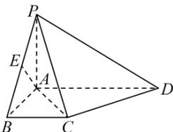

> [!faq]- 全练一本通解析
> **【答案】** $\frac{\sqrt{2}}{2}$
>
> **【解析】**
> 在平面 PAB 中过 A 作 $AE \perp PB$ ，垂足为 E，
> 
> 因为 $PA \perp$ 平面 $ABCD, \angle PBA = \frac{\pi}{4}, PA = 1$ ,
> 所以 $PA = AB = 1$ ,
> 所以 $PB = \sqrt{2}, AE = \frac{1}{2} PB = \frac{\sqrt{2}}{2}$ ,
> 因为 $\angle ABC = \frac{\pi}{2}$ , 则 $BC \perp AB$ ,
> 因为 $BC \subset$ 平面 $ABCD$ , 所以 $PA \perp BC$ ,
> 又 $AB \cap PA = A, AB, PA \subset$ 平面 $PAB$ , 所以 $BC \perp$ 平面 $PAB$ ,
> 因为 $AE \subset$ 平面 $PAB$ , 所以 $BC \perp AE$ ,
> 又 $AE \perp PB, BC \cap PB = B, BC, PB \subset$ 平面 $PBC$ , 所以 $AE \perp$ 平面 $PBC$ ,
> 所以 $AE$ 为点 $A$ 到平面 $PBC$ 的距离, 即所求为 $AE = \frac{\sqrt{2}}{2}$ .
