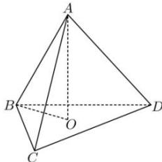

> [!faq]- 全练一本通解析
> **【答案】** $\frac{\sqrt{6}}{3}$
>
> **【解析】**
> 设 O 是底面 $\triangle BCD$ 的中心, 则 $AO \perp$ 平面 BCD, 又因为 $BO \subset$ 平面 BCD, 所以 $AO \perp BO$ , 正四面体 ABCD 的棱长为 1,
> 则 $BO = \frac{2}{3} \times \frac{\sqrt{3}}{2} \times 1 = \frac{\sqrt{3}}{3}$ , $AO=\sqrt{AB^{2}-BO^{2}}=\sqrt{1^{2}-\left(\frac{\sqrt{3}}{3}\right)^{2}}=\frac{\sqrt{6}}{3}$
> 故答案为: $\frac{\sqrt{6}}{3}$ .
> 
