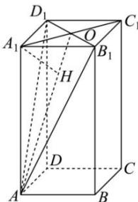

> [!faq]- 全练一本通解析
> **【答案】** D
>
> **【解析】**
> $\frac{4}{3}$
> 解析: 设 $A_{1}C_{1} \cap B_{1}D_{1} = O$ ，连接 AO, $AB_{1}, AD_{1}$ ，由题意 $AB_{1} = AD_{1} = 2\sqrt{5}$ ，O 是 $B_{1}D_{1}$ 中点，∴ $AO \perp B_{1}D_{1}$ ，
> 又 $A_{1}C_{1} \perp B_{1}D_{1}$ ， $A_{1}C_{1} \cap AO = O$ ， $A_{1}C_{1}, AO \subset$ 平面 $AA_{1}O$ ，
> 所以 $B_{1}D_{1} \perp$ 平面 $AA_{1}O$ 作 $A_{1}H \perp AO$ 于点 H，如图，则 $A_{1}H \subset$ 平面 $AA_{1}O$ ，∴ $B_{1}D_{1} \perp A_{1}H$ ，
> 而 $AO \cap B_{1}D_{1} = O$ ， $AO, B_{1}D_{1} \subset$ 平面 $AB_{1}D_{1}$ 所以 $A_{1}H \perp$ 平面 $AB_{1}D_{1}$ 正四棱柱 ABCD- $A_{1}B_{1}C_{1}D_{1}$ 中，侧棱 $AA_{1}$ 与底面 $A_{1}B_{1}C_{1}D_{1}$ 垂直，则必垂直该底面上的直线 $A_{1}C_{1}$ Rt△AA₁O 中， $AA_{1}=4$ ， $A_{1}O=\frac{1}{2}A_{1}C_{1}=\sqrt{2}$ ，因此 $AO=\sqrt{4^{2}+2}=3\sqrt{2}$ ，
> 所以 $A_{1}H=\frac{AA_{1}\cdot A_{1}O}{AO}=\frac{4\times\sqrt{2}}{3\sqrt{2}}=\frac{4}{3}$ . 故选：D.
> 
