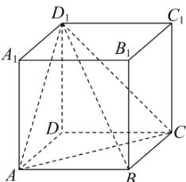

> [!faq]- 全练一本通解析
> **【答案】** $\frac{2\sqrt{3}}{3}$
>
> **【解析】**
> 连接 $BD_{1}$ ，设 B 到平面 $ACD_{1}$ 的距离为 h，
> $$
> V _ {D _ {1} - A B C} = V _ {B - A C D _ {1}}, \frac {1}{3} \times S _ {\triangle A B C} \times D D _ {1} = \frac {1}{3} \times S _ {\triangle A C D _ {1}} \times h
> $$
> $$
> S _ {\triangle A B C} \times D D _ {1} = S _ {\triangle A C D _ {1}} \times h, \frac {1}{2} \times 2 \times 2 \times 2 = \frac {1}{2} \times 2 \sqrt {2} \times 2 \sqrt {2} \times \sin 6 0 ^ {\circ} \times h,
> $$
> 解得 $h = \frac{2\sqrt{3}}{3}$ ，即点 $B$ 到平面 $ACD_{1}$ 的距离为 $\frac{2\sqrt{3}}{3}$
> 
