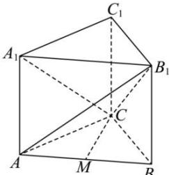

> [!faq]- 全练一本通解析
> **【答案】** A
>
> **【解析】**
> 解析: 取 AB 的中点 M, 连接 CM,
> 
> 因为 $\triangle ABC$ 为等边三角形, 则 $CM \perp AB$ , 又因为 $AA_{1} \perp$ 平面 $ABC$ , 且 $CM \subset$ 平面 $ABC$ , 则 $CM \perp AA_{1}$ , 且 $AB \cap AA_{1} = A$ , $AB, AA_{1} \subset$ 平面 $ABB_{1}A_{1}$ , 可得 $CM \perp$ 平面 $ABB_{1}A_{1}$ , 由题意可知: $AB_{1} = CB_{1} = \sqrt{2}, CM = \frac{\sqrt{3}}{2}$ , 设点 $A_{1}$ 到平面 $AB_{1}C$ 的距离为 $d$ , 因为 $V_{A_1 - AB_1C} = V_{C - AA_1B_1}$ , 即 $\frac{1}{3} \times d \times \frac{1}{2} \times 1 \times \sqrt{\left(\sqrt{2}\right)^2 - \left(\frac{1}{2}\right)^2} = \frac{1}{3} \times \frac{\sqrt{3}}{2} \times \frac{1}{2} \times 1 \times 1$ ,解得 $d=\frac{\sqrt{21}}{7}$ ，所以点 $A_{1}$ 到平面 $AB_{1}C$ 的距离为 $\frac{\sqrt{21}}{7}$ 。
>
> 故选 **A**.
