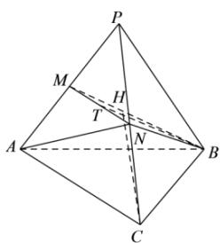

> [!faq]- 全练一本通解析
> **【答案】** $\frac{4\sqrt{22}}{11}$
>
> **【解析】**
> 正四面体 P-ABC 中，取 △ABP 的中心为 H，则 CH⊥ 平面 PAB，
> 故 AM = PM = 2，BM = $2\sqrt{3}$ ，
> 其中 BH = $\frac{2}{3} BM = \frac{4\sqrt{3}}{3}$ ，由勾股定理得 $CH = \sqrt{4^{2} - (\frac{4\sqrt{3}}{3})^{2}} = \frac{4\sqrt{6}}{3}$ ，
> 故点 N 到平面 PAB 的距离为 $\frac{1}{2} \times \frac{4\sqrt{6}}{3} = \frac{2\sqrt{6}}{3}$ ，
> 又 $S_{\triangle ABM} = \frac{1}{2} S_{\triangle ABP} = \frac{1}{2} \times \frac{\sqrt{3}}{4} \times 4^{2} = 2\sqrt{3}$ ，
> 故 $V_{N-AMB} = \frac{1}{3} S_{\triangle ABM} \cdot \frac{2\sqrt{6}}{3} = \frac{1}{3} \times 2\sqrt{3} \times \frac{2\sqrt{6}}{3} = \frac{4\sqrt{2}}{3}$ ，
> 又 BM = BN = $2\sqrt{3}$ ，MN = $\frac{1}{2} AC = 2$ ，
> 取 MN 的中点 T，连接 BT，则 BT⊥ MN，
> 则 $|BT| = \sqrt{BN^{2} - NT^{2}} = \sqrt{12 - 1} = \sqrt{11}$ ，
> 故 $S_{\triangle BMN} = \frac{1}{2}|MN| \cdot |BT| = \frac{1}{2} \times 2 \times \sqrt{11} = \sqrt{11}$ ，
> 设点 A 到平面 BMN 的距离为 d，
> 故 $\frac{1}{3} S_{\triangle BMN} \cdot d = \frac{4\sqrt{2}}{3}$ ，即 $\frac{\sqrt{11}}{3} \cdot d = \frac{4\sqrt{2}}{3}$ ，
> 解得 $d = \frac{4\sqrt{22}}{11}$ .
> 
