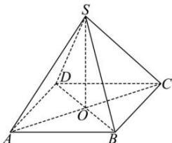

> [!faq]- 全练一本通解析
> **【答案】** D
>
> **【解析】**
> 解析:如图,连接 AC,BD 交于点 O,连接 SO,
> 根据已知可得, $SO \perp$ 平面 ABCD.
> 又 $OD=\frac{1}{2}BD=\frac{1}{2}\times\sqrt{2}BC=2\sqrt{2}$ , SD=4,
> 在 Rt△SOD 中,有 $SO=\sqrt{SD^{2}-OD^{2}}=2\sqrt{2}$ .
> 由已知可得 BC // AD, AD ⊂ 平面 SAD, BC ∉ 平面 SAD,
> 所以, BC // 平面 SAD.
> 又 $P \in BC$ , 所以点 P 到平面 SAD 的距离, 即等于点 B 到平面 SAD 的距离.
> 设点 B 到平面 SAD 的距离为 h,
> 则 $V_{B-SAD} = \frac{1}{3} \times S_{\triangle SAD} \cdot h$ .
> 又 $V_{S-ABD} = \frac{1}{3} \times S_{\triangle ABD} \times SO = \frac{1}{3} \times \frac{1}{2} AB \times AD \times SO$ $=\frac{1}{3}\times\frac{1}{2}\times4\times4\times2\sqrt{2}=\frac{16}{3}\sqrt{2}$ , $S_{\triangle SAD}=\frac{1}{2}SA\times SD\times\sin\frac{\pi}{3}=\frac{1}{2}\times4\times4\times\frac{\sqrt{3}}{2}=4\sqrt{3}$ ,
> 所以, $V_{B-SAD} = \frac{1}{3} \times S_{\triangle SAD} \cdot h = \frac{1}{3} \times 4\sqrt{3}h = V_{S-ABD} = \frac{16}{3}\sqrt{2}$ ,
> 所以, $h=\frac{4\sqrt{6}}{3}$ .
> 
>
> 故选 **D**.
