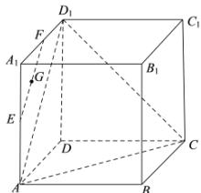

> [!faq]- 全练一本通解析
> **【答案】** A
>
> **【解析】**
> 解析:如图所示,
> 
> 因为点 E, F 分别是棱 $AA_{1}$ ， $A_{1}D_{1}$ 的中点，
> 所以 $EF \parallel AD_{1}$ ,
> 又 $EF \not\subset$ 平面 $ACD_{1}$ ， $AD_{1} \subset$ 平面 $ACD_{1}$ ，
> 所以 $EF \parallel$ 平面 $ACD_{1}$ ，
> 所以点 G 到平面 $ACD_{1}$ 的距离即为点 E 或 F 到平面 $ACD_{1}$ 的距离.
> 因为该正方体的棱长为4，
> 所以 $AD_{1}=AC=CD_{1}=4\sqrt{2}$ 所以 $\triangle ACD_{1}$ 为等边三角形，
> 所以 $S_{\triangle ACD_{1}}=\frac{1}{2}\times4\sqrt{2}\times4\sqrt{2}\times\frac{\sqrt{3}}{2}=8\sqrt{3}$ $S_{\triangle FAD_{1}}=\frac{1}{2}\times2\times4=4$ 设 F 到平面 $ACD_{1}$ 的距离为 d，则 $V_{F-ACD_{1}}=V_{C-FAD_{1}}$ ，即 $\frac{1}{3}S_{\triangle ACD_{1}}d=\frac{1}{3}S_{\triangle FAD_{1}}\times4$ ，于是有 $\frac{1}{3}\times8\sqrt{3}d=\frac{1}{3}\times4\times4$ ，解得 $d=\frac{2\sqrt{3}}{3}$
> 所以点 G 到平面 $ACD_{1}$ 的距离为 $\frac{2\sqrt{3}}{3}$ .
>
> 故选 **A**.
