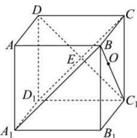

> [!faq]- 全练一本通解析
> **【答案】** B
>
> **【解析】**
> 解析:如图, 设 $C_{1}D \cap CD_{1} = E$ , 且正方体 $ABCD - A_{1}B_{1}C_{1}D_{1}$ 棱长为 1,
> 所以 $C_{1}D \perp CD_{1}$ , $BC \perp$ 平面 $CC_{1}D_{1}D$ , 又 $C_{1}D \subset$ 平面 $CC_{1}D_{1}D$ , 所以 $BC \perp C_{1}D$ ,
> 因为 $CD_{1} \cap BC = C$ , $CD_{1}, BC \subset$ 平面 $BCD_{1}A_{1}$ , 所以 $C_{1}D \perp$ 平面 $BCD_{1}A_{1}$ , $C_{1}E$ 的长即为点 $C_{1}$ 到平面 $BCD_{1}A_{1}$ 的距离, $C_{1}E = \frac{1}{2}C_{1}D = \frac{\sqrt{2}}{2}$ ,
> 因为点 O 在线段 $BC_{1}$ 上且 $BO = \frac{1}{2}OC_{1}$ ,
> 所以点 O 到平面 $BCD_{1}A_{1}$ 的距离 $d = \frac{1}{3}C_{1}E = \frac{\sqrt{2}}{6}$ .
> 
>
> 故选 **B**
