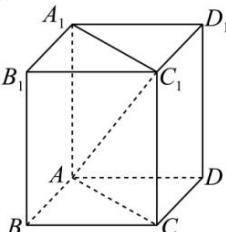

> [!faq]- 全练一本通解析
> **【答案】** √6
>
> **【解析】**
> 解: 如图, 连接 AC
> 
> 正四棱柱 $ABCD - A_1B_1C_1D_1$ 的底面边长为1，则 $AD = DC = 1$ ，所以 $AC = \sqrt{2} AD = \sqrt{2}$ 且 $C_1C\bot$ 底面ABCD，则直线 $AC_{1}$ 与底面ABCD所成角即 $\angle C_1AC = 60^\circ$ 则 $C_1C = AC\cdot \tan 60^{\circ} = \sqrt{2}\times \sqrt{3} = \sqrt{6}$ 则在正四棱柱 $ABCD - A_1B_1C_1D_1$ 中， $A_{1}C_{1}$ 到底面ABCD的距离为即 $C_1$ 到到底面 ABCD 的距离 $C_{1}C=\sqrt{6}$ . 故答案为: $\sqrt{6}$ .
