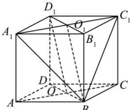

> [!faq]- 全练一本通解析
> **【答案】** （1）证明见解析（2） $\frac{\sqrt{3}}{3}$
>
> **【解析】**
> （1）连接 BD 交 AC 于点 O, 连接 BO.
> 解析：（1）连接 $B_{1}D_{1}$ 交 $A_{1}C_{1}$ 于点 $O_{1}$ ，连接 $BO_{1}$
> 
> ∵ $BB_{1}//DD_{1}$ , $BB_{1}=DD_{1}$ , ∴ 四边形 $BDD_{1}B_{1}$ 为平行四边形,
> ∴ $BD//B_{1}D_{1}$ , $BD=B_{1}D_{1}$ ,
> ∵ 四边形 ABCD, $A_{1}B_{1}C_{1}D_{1}$ 为平行四边形, ∴ $O,O_{1}$ 分别为 $BD,B_{1}D_{1}$ 中点,
> ∴ $OB//O_{1}D_{1}$ , $OB=O_{1}D_{1}$ , ∴ 四边形 $OBO_{1}D_{1}$ 为平行四边形, ∴ $OD_{1}//BO_{1}$ ,
> ∵ $BO_{1}\subset$ 平面 $A_{1}BC_{1}$ , $OD_{1}\not\subset$ 平面 $A_{1}BC_{1}$ , ∴ $OD_{1}//$ 平面 $A_{1}BC_{1}$ .
> （2）由（1）知： $OD_{1}//$ 平面 $A_{1}BC_{1}$ ，则直线 $OD_{1}$ 与平面 $A_{1}BC_{1}$ 之间的距离即为点 $D_{1}$ 到平面 $A_{1}BC_{1}$ 的距离,
> ∵ $A_{1}B = BC_{1} = A_{1}C_{1} = \sqrt{2}$ , ∴△A₁BC₁为边长为√2的等边三角形,
> ∴ $S_{\triangle A_{1}BC_{1}} = \frac{1}{2} \times \sqrt{2} \times \sqrt{2} \times \frac{\sqrt{3}}{2} = \frac{\sqrt{3}}{2}$ ;
> 又 $S_{\triangle A_{1}C_{1}D_{1}} = \frac{1}{2} \times 1 \times 1 = \frac{1}{2}, \therefore V_{B-A_{1}C_{1}D_{1}} = \frac{1}{3} S_{\triangle A_{1}C_{1}D_{1}} \cdot BB_{1} = \frac{1}{3} \times \frac{1}{2} \times 1 = \frac{1}{6},$ 设点 $D_{1}$ 到平面 $A_{1}BC_{1}$ 的距离为 d，
> 则 $V_{D_{1}-A_{1}BC_{1}} = V_{B-A_{1}C_{1}D_{1}} = \frac{1}{3} S_{\triangle A_{1}BC_{1}} \cdot d = \frac{\sqrt{3}}{6} d = \frac{1}{6},$ 解得: $d = \frac{\sqrt{3}}{3},$ ∴ 直线 $OD_{1}$ 与平面 $A_{1}BC_{1}$ 之间的距离为 $\frac{\sqrt{3}}{3}.$
