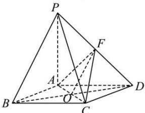
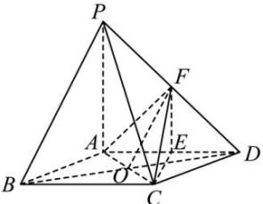

> [!faq]- 全练一本通解析
> **【答案】** （1）证明见解析（2） $\frac{2\sqrt{21}}{7}.$
>
> **【解析】**
> （1）连接 BD 交 AC 于 O，连接 FO，
> ∵ F 为 AD 的中点，O 为 BD 的中点，则 OF // PB，
> ∵ PB ∉ 平面 ACF, OF ⊆ 平面 ACF, ∴ PB // 平面 ACF.
> 
> (2) 由于 $PB //$ 平面 $ACF$ , 则 $PB$ 到平面 $ACF$ 的距离, 即 $P$ 到平面 $ACF$ 的距离.
> 又因为 $F$ 为 $PD$ 的中点, 点 $P$ 到平面 $ACF$ 的距离与点 $D$ 到平面 $ACF$ 的距离相等.
> 取 $AD$ 的中点 $E$ , 连接 $EF, CE$ ,
> 
> 则 $EF / / PA$ ，因为 $PA \perp$ 平面 $ABCD$ ，所以 $EF \perp$ 平面 $ABCD$ ，因为 $CE \subset$ 平面 $ABCD$ ，所以 $EF \perp CE$ ，因为菱形 $ABCD$ 且 $\angle ABC = 60^{\circ}$ ， $PA = AD = 2$ ，所以 $CE = \sqrt{3}$ ， $EF = 1$ ，则 $CF = \sqrt{EF^2 + CE^2} = \sqrt{1 + 3} = 2$ ， $AC = 2$ ， $AF = \frac{1}{2}PD = \frac{1}{2}\sqrt{4 + 4} = \sqrt{2}$ ， $S_{\triangle ACF} = \frac{1}{2} \times \sqrt{2} \times \sqrt{4 - \frac{1}{2}} = \frac{\sqrt{7}}{2}$ 设点 $D$ 到平面 $ACF$ 的距离为 $h_D$ ，由 $V_{D-ACF} = V_{F-ACD}$ 得 $\frac{1}{3} S_{\triangle ACF} \times h_D = \frac{1}{3} S_{\triangle ACD} \times EF \Rightarrow h_D = \frac{S_{\triangle ACD} \times EF}{S_{\triangle ACF}} = \frac{\sqrt{3} \times 1}{\frac{\sqrt{7}}{2}} = \frac{2\sqrt{21}}{7}$ 即直线 $PB$ 到平面 $ACF$ 的距离为 $\frac{2\sqrt{21}}{7}$ .
