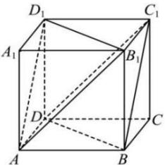

<!-- question-source:start -->
【32】(2020·四川遂宁二模)如图,用六个完全相同的正方形围成的立体图形叫正六面体.已知正六面体 $ABCD-A_{1}B_{1}C_{1}D_{1}$ 的棱长为4,则平面 $AB_{1}D_{1}$ 与平面 $BC_{1}D$ 间的距离为（）

A. $\sqrt{3}$ B. $\frac{\sqrt{6}}{3}$ C. $\frac{4\sqrt{3}}{3}$ D. $2\sqrt{3}$
<!-- question-source:end -->

![[Q00006046A1]]
