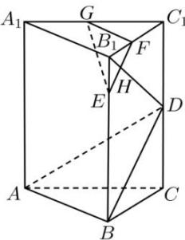

<!-- question-source:start -->
【33】（2023·广东揭阳高一期末）如图在直三棱柱 $ABC-A_{1}B_{1}C_{1}$ 中， $\angle ABC=90^{\circ}$ ，BC=2， $CC_{1}=4$ ，E是 $BB_{1}$ 上的一点，且 $EB_{1}=1$ ，D、F、G分别是 $CC_{1}$ 、 $B_{1}C_{1}$ 、 $A_{1}C_{1}$ 的中点，EF与 $B_{1}D$ 相交于H.
（1）求证： $B_{1}D \perp$ 平面ABD；

(2) 求平面 EGF 与平面 ABD 的距离.

<!-- question-source:end -->

![[Q00006047A1]]
