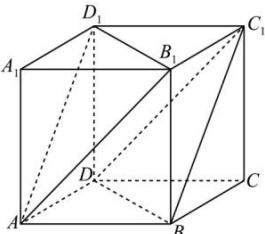

<!-- question-source:start -->
【34】（2022·上海黄浦高二阶段练习）如图，正方体 $ABCD-A_{1}B_{1}C_{1}D_{1}$ 中， $AA_{1}=a$ .

（1）求证：平面 $AB_{1}D_{1}$ // 平面 $C_{1}BD$ ；

(2) 求两平面 $AB_{1}D_{1}$ 与 $C_{1}BD$ 之间的距离.

<!-- question-source:end -->

![[Q00006048A1]]
