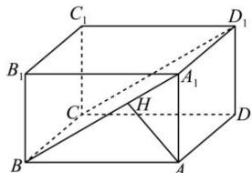

> [!faq]- 全练一本通解析
> **【答案】** $\frac{60}{13}$
>
> **【解析】**
> 因为平面 $\alpha \parallel$ 平面 $A_{1}D_{1}CB$ ， $AD \subset$ 平面 $\alpha$ ，所以 AD 到平面 $A_{1}D_{1}CB$ 的距离即为平面 $\alpha$ 与平面 $A_{1}D_{1}CB$ 间的距离，易知 $AD \parallel$ 平面 $A_{1}D_{1}CB$ ，从而点 A 到平面 $A_{1}D_{1}CB$ 的距离即为所求的距离。
> 如图, 过点 A 作 $AH \perp A_{1}B$ 于点 H.
> 因为 $A_{1}D_{1} \perp$ 平面 $A_{1}B_{1}BA$ ， $A_{1}D_{1} \subset$ 平面 $A_{1}D_{1}CB$ 所以平面 $A_{1}B_{1}BA \perp$ 平面 $A_{1}D_{1}CB$ 又平面 $A_{1}B_{1}BA \cap$ 平面 $A_{1}D_{1}CB = A_{1}B$ 所以 AH⊥平面 $A_{1}D_{1}CB$ ，则 AH 即为所求.
> 在 Rt△BAA₁ 中，AB=12，AA₁=5，则 $A_{1}B=\sqrt{AB^{2}+AA_{1}^{2}}=13$ 因为 $AH \cdot A_{1}B = A_{1}A \cdot AB$ ，所以 $AH = \frac{A_{1}A \cdot AB}{A_{1}B} = \frac{60}{13}$ .
> 故平面 $\alpha$ 与平面 $A_{1}D_{1}CB$ 的距离为 $\frac{60}{13}$ . 故答案为: $\frac{60}{13}$
> 
