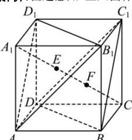

> [!faq]- 全练一本通解析
> **【答案】** C
>
> **【解析】**
> 由题意知：正六面体 $ABCD - A_{1}B_{1}C_{1}D_{1}$ 是棱长为4的正方体，
> 
> $\because AB_{1} // C_{1}D, B_{1}D_{1} // BD, AB_{1} \cap B_{1}D_{1} = B_{1}, C_{1}D \cap BD = D,$ $\therefore$ 平面 $AB_{1}D_{1} //$ 平面 $BC_{1}D$ 连接 $A_{1}C$ $\because B_{1}D_{1} \perp A_{1}C_{1}, B_{1}D_{1} \perp AA_{1}, A_{1}C_{1} \cap AA_{1} = A_{1}, \therefore B_{1}D_{1} \perp$ 平面 $AA_{1}C$ 又 $AC \subset$ 平面 $AA_{1}C, \therefore B_{1}D_{1} \perp A_{1}C$ ，同理可证得： $AD_{1} \perp A_{1}C$ 又 $B_{1}D_{1}, AD_{1} \subset$ 平面 $ABD_{1}, B_{1}D_{1} \cap AD_{1} = D_{1}, \therefore A_{1}C \perp$ 平面 $AB_{1}D_{1}$ ，$\therefore A_{1}C \perp$ 平面 $BC_{1}D$ ，
> 设垂足分别为 $E, F$ ，则平面 $AB_{1}D_{1}$ 与平面 $BC_{1}D$ 间的距离为 $\left|EF\right|$ 。
> 正方体的体对角线长为 $\sqrt{4^2 + 4^2 + 4^2} = 4\sqrt{3}$ 。
> 在三棱锥 $A_{1} - AB_{1}D_{1}$ 中，由等体积法求
> 得： $\left|A_{1}E\right| = \frac{\frac{1}{2} \times 4 \times 4 \times 4}{\frac{1}{2} \times 4\sqrt{2} \times 4\sqrt{2} \times \frac{\sqrt{3}}{2}} = \frac{4\sqrt{3}}{3}$ ， $\therefore$ 平面 $AB_{1}D_{1}$ 与平面 $BC_{1}D$ 间的距离为： $4\sqrt{3} - \frac{8\sqrt{3}}{3} = \frac{4\sqrt{3}}{3}$ 。故选： $C$ 。
