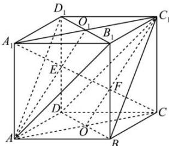

> [!faq]- 全练一本通解析
> **【答案】** （1）证明见解析；（2） $\frac{\sqrt{3}}{3}a$ 。
>
> **【解析】**
> （1）正方体 $ABCD-A_{1}B_{1}C_{1}D_{1}$ 中， $BD//B_{1}D_{1}$ ， $AB_{1}//DC_{1}$ 且 $B_{1}D_{1}$ 不在平面 $BDC_{1}$ 内，
> 所以 $B_{1}D_{1} // 平面 BDC_{1}$ 同理可得， $AB_{1} // 平面 BDC_{1}$ 又∵ $AB_{1}\cap B_{1}D_{1}=B_{1}$ ∴平面 $AB_{1}D_{1} // 平面 BDC_{1}$ ;
> （2）如图，设 $AC \cap BD = O, A_{1}C_{1} \cap B_{1}D_{1} = O_{1}$ ，连接 $A_{1}C, AO, OC_{1}$
> 
> $\because BD \perp AC, BD \perp CC_{1}, AC \cap CC_{1} = C$ ， $\therefore BD \perp$ 平面 $ACC_{1}A_{1}$ ， $\therefore BD \perp A_{1}C$ 又正方体 $ABCD - A_{1}B_{1}C_{1}D_{1}$ 中， $BC_{1} \perp$ 平面 $A_{1}B_{1}C$ $\therefore BC_{1} \perp A_{1}C$ ，又 $BD \cap BC_{1} = B$ $\therefore A_{1}C \perp$ 平面 $BDC_{1}$ ，根据（1），平面 $AB_{1}D_{1} //$ 平面 $BDC_{1}$
> $\therefore A_{1}C \perp$ 平面 $AB_{1}D_{1}$ ,
> ∴图中线段 $EF$ 为两平面的公垂线段，线段 $EF$ 的长即为两平面间的距离，
> 平行四边形 $ACC_{1}A_{1}$ 中， $O,O_{1}$ 分别是 $AC,A_{1}C_{1}$ 的中点，
> ∴ $E,F$ 是线段 $A_{1}C$ 的三等分点，
> ∴ $EF = \frac{1}{3} A_1C = \frac{1}{3}\times \sqrt{3} AA_1 = \frac{\sqrt{3}a}{3}$ ∴两平面 $AB_{1}D_{1}$ 与 $C_1BD$ 之间的距离为 $\frac{\sqrt{3}a}{3}$
