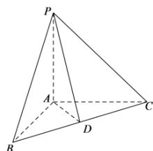

> [!faq]- 全练一本通解析
> **【答案】** $\sqrt{11}$
>
> **【解析】**
> 取 BC 中点 D, 连接 AD, PD, 因为 AB = AC = 2, $\triangle ABC$ 是直角三角形,
> 所以 $AD \perp BC$ 且 $AD = \sqrt{2}$ ,
> 
> 因为 $PA \perp$ 平面 ABC, AD, BC ⊂ 平面 ABC,
> 所以 $PA \perp AD$ ， $BC \perp PA$ ，
> 又因为 $BC \perp AD, AD \cap PA = A, AD, PA \subset$ 平面 PAD，
> 所以 $BC \perp$ 平面 PAD, PD ⊂ 平面 PAD
> 所以 $BC \perp PD$ ，即 $PD$ 即为所求，
> 又因为 $PA = 3$ ， $AD = \sqrt{2}$
> 所以 $PD = \sqrt{11}$ ，即点 P 到直线 BC 的距离为 $\sqrt{11}$ 。故答案为： $\sqrt{11}$ 。
