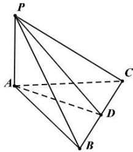

> [!faq]- 全练一本通解析
> **【答案】** 2
>
> **【解析】**
> 取 BC 中点 D, 连接 AD, PD
> 因为 $\triangle ABC$ 为正三角形, 所以 $AD \perp BC$ 又因为 $PA \perp$ 平面 ABC, $BC \subset$ 平面 ABC, 则 $BC \perp PA$ , 又 $PA \cap AD = A$ ,
> 则 $BC \perp$ 平面 PAD, 则 $BC \perp PD$ ,
> 又正三角形 ABC 的边长为 2, 则 $AD = \sqrt{3}$ 则 $PD = \sqrt{PA^{2} + AD^{2}} = \sqrt{1 + 3} = 2$ 所以 P 到 BC 的距离为 2
> 故答案为:2
> 
