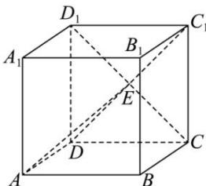

> [!faq]- 全练一本通解析
> **【答案】** B
>
> **【解析】**
> 解析:如图所示,连接 $C_{1}D$ , 设 $C_{1}D \cap CD_{1} = E$ , 分别连接 DE, AE,
> 在正方体 $ABCD-A_{1}B_{1}C_{1}D_{1}$ 中, 可得 $AD \perp$ 平面 $CDD_{1}C_{1}$ ,
> 因为 $CD_{1} \subset$ 平面 $CDD_{1}C_{1}$ ，所以 $AD \perp CD_{1}$ 又由正方形 $CDD_{1}C_{1}$ 中, 可得 $C_{1}D \perp CD_{1}$ , 即 $C_{1}E \perp CD_{1}$ ,
> 因为 $AD \cap DE = D$ , 且 $AD, DE \subset$ 平面 ADE, 所以 $CD_{1} \perp$ 平面 ADE,
> 又因为 $AE \subset$ 平面 ADE, 所以 $AE \perp CD_{1}$ , 所以 AE 即为点 A 直线 $CD_{1}$ 的距离, 在直角 $\triangle ADE$ 中, $AE = \sqrt{AD^{2} + DE^{2}} = \sqrt{1^{2} + (\frac{\sqrt{2}}{2})^{2}} = \frac{\sqrt{6}}{2}$ . 故选:B.
> 
