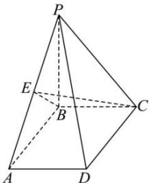

> [!faq]- 全练一本通解析
> **【答案】** B
>
> **【解析】**
> 解析: 因为 $PB \perp$ 平面 ABCD, $BC \subset$ 平面 ABCD, 所以 $PB \perp BC$ ,
> 又因为 $AB \perp BC$ ，且 $AB \cap PB = B$ ， $AB, PB \subset$ 平面 PAB，所以 $BC \perp$ 平面 PAB，
> 因为 $PA \subset$ 平面 PAB，所以 $PA \perp BC$ 取 PA 的中点 E，因为 PB = AB，所以 $PA \perp BE$ 又因为 $BE \cap BC = B$ ，且 $BE, BC \subset$ 平面 BCE，所以 $PA \perp$ 平面 BCE，
> 因为 $CE \subset$ 平面 BCE，所以 $CE \perp PA$ ，所以 CE 即为点 C 到直线 PA 的距离，
> 在等腰直角 $\triangle PAB$ 中，由 PB = AB = 4，可得 $BE = 2\sqrt{2}$ 在直角 $\triangle BCE$ 中，由 BC = 2，可得 $CE = \sqrt{BC^{2} + BE^{2}} = 2\sqrt{3}$ 所以点 C 到直线 PA 的距离为 $2\sqrt{3}$ . 故选：B.
> 
