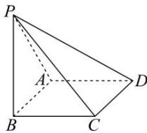

<!-- question-source:start -->
【45】（21-22 高二·上海杨浦·期中）如图，已知四棱锥 P-ABCD 中，ABCD 为矩形， $PB \perp$ 平面 ABCD， $BC = 3, PC = 5, PA = 4\sqrt{2}$ ，异面直线 BC 与 PD 之间的距离为 \_\_\_\_.

<!-- question-source:end -->

![[Q00006059A1]]
