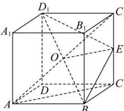

> [!faq]- 全练一本通解析
> **【答案】** $\frac{\sqrt{2}}{2}a$
>
> **【解析】**
> 解: 分别取 $BD_{1}$ , $CC_{1}$ 中点 O, E, 连接 $D_{1}E$ , BE, OE, AC, $AC_{1}$ , 如图所示:
> 
> $$
> \because D _ {1} E = B E = \sqrt {a ^ {2} + \left(\frac {a}{2}\right) ^ {2}} = \frac {\sqrt {5} a}{2},
> $$
> $\therefore OE \perp BD_{1}$ $\because OC_{1} = \frac{1}{2} AC_{1} = \frac{1}{2}\sqrt{AB^{2} + BC^{2} + CC_{1}^{2}} = \frac{\sqrt{3}}{2} a$ $\because OE = \frac{1}{2} AC = \frac{\sqrt{2}}{2} a, C_{1}E = \frac{1}{2} a$ 满足 $OE^2 + C_1E^2 = OC_1^2 = \frac{3}{4} a^2$ $\therefore OE \perp CC_{1}$ 由两条异面直线之间距离的定义可得直线 $BD_{1}$ 与 $CC_{1}$ 之间的距离即为公垂线段 $OE$ 的长度，
> 又 $BD_{1} = \sqrt{a^{2} + a^{2} + a^{2}} = \sqrt{3} a$ 则 $OE = \sqrt{D_1E^2 - (\frac{1}{2} BD_1)^2} = \sqrt{\frac{5a^2}{4} - \frac{3a^2}{4}} = \frac{\sqrt{2}}{2} a$ ，故答案为： $\frac{\sqrt{2}}{2} a$ ：
