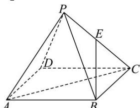

> [!faq]- 全练一本通解析
> **【答案】** $\frac{1}{2}$
>
> **【解析】**
> 
> 因为为 $\triangle PBC$ 等边三角形， $E$ 为的中点，
> 所以 $PE \perp BE$ ，
> 由已知 $PA = 1$ ， $PC = 1$ ， $AC = \sqrt{2}$ ，
> 所以 $PA^2 + PC^2 = AC^2$ ，
> 所以 $PA \perp PC$ ，
> 所以 $PE$ 为异面直线 $PA$ ， $BE$ 的公垂线段，
> 所以 $PE$ 的长为动点 $M$ 到直线 $BE$ 的距离最小值，
> 所以动点 $M$ 到直线 $BE$ 的距离最小值为 $\frac{1}{2}$ . 故答案为： $\frac{1}{2}$ .
